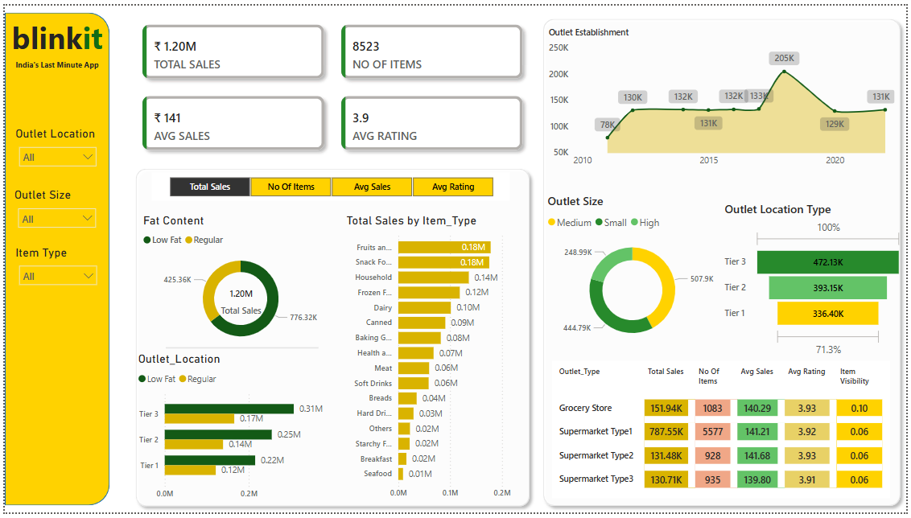

# 🛒 Quick Delivery Orders Data Analysis Dashboard

## 📝 Overview
This Power BI dashboard provides a comprehensive sales performance overview for Blinkit — a quick-commerce platform. The goal of this dashboard is to uncover patterns in sales, product types, outlet characteristics, and item visibility across different outlet tiers and formats.

It is designed to support business, category, and operations teams in understanding where sales are strongest and how product attributes and outlet configurations impact performance.

## 📂 Data Source
The dataset used includes:
- Sales records segmented by item type, fat content, outlet size and location
- Total and average sales
- Customer ratings and item visibility
- Outlet establishment trends from 2010 to 2023

Data was modeled in Power BI with DAX measures for KPIs such as average sales, number of items, and rating breakdowns.

## 📈 Key Features
- **High-Level KPIs:** 
  - ₹1.20M in total sales
  - 8,523 items sold
  - ₹141 average sales per item
  - Average product rating of 3.9 stars

- **Segmentation Views:**
  - Sales split by **fat content** (Low Fat vs. Regular)
  - Distribution by **Item Type** (Top categories: Fruits, Snacks, Household)
  - Breakdown by **Outlet Location Tier** and **Outlet Size** (Small, Medium, High)

- **Trend Analysis:** 
  - Outlet establishment growth from 2010–2023 with peak in 2019 (205K outlets)
  
- **Performance by Outlet Type:** 
  - Supermarkets (Type 1 & 2) lead in sales, followed by grocery stores
  - Metric table includes total sales, average sales, rating, and item visibility

- **Interactive Filters:** 
  - Users can slice the data by **Location Tier**, **Outlet Size**, and **Item Type**

## 🔍 Insights
- **Tier 3 outlets** contributed the highest sales (₹472K), outperforming Tier 1 locations.
- **Supermarket Type 1** dominated with ₹787K in sales and over 5,500 items sold.
- **Low Fat** items drove ~35% of total sales, showing potential for health-conscious segments.
- Visibility of items was consistent across outlet types, though Grocery Stores had slightly higher visibility metrics.

## 🛠️ Tools Used
- Power BI (Data modeling, visualization, DAX)
- Excel (initial data cleaning and pivoting)

## 📸 Screenshot

## 💡 Learnings
Through this project, I gained:
- Deeper understanding of how to build retail-style dashboards with interactive filters
- Experience in working with categorical KPIs and conditional formatting in Power BI
- Skill in crafting dashboards that align with business decision-making needs

---

